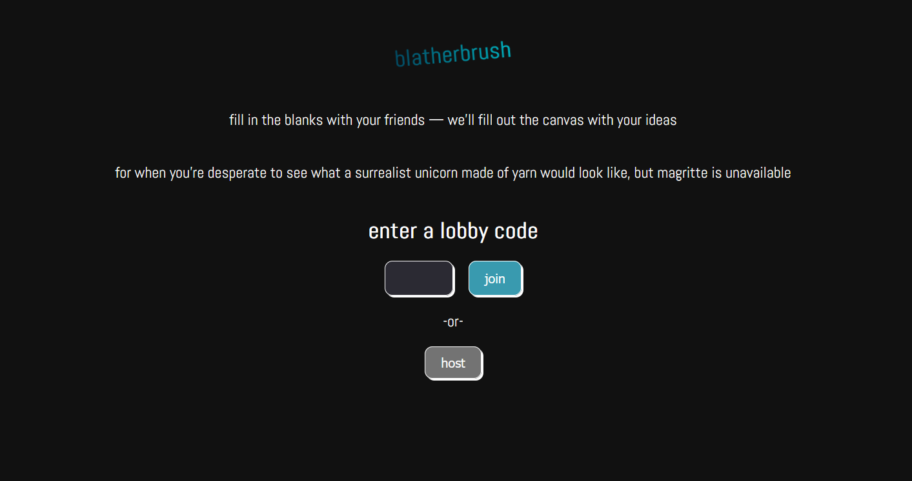
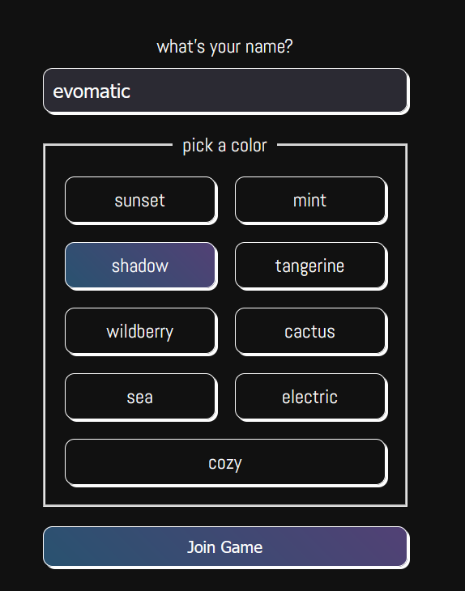

# Blatherbrush

Blatherbrush is a mad-libs type game that sends prompts over to [DALL-E](https://openai.com/dall-e-2) to generate art with it. Players can join lobbies using their own smart phones!





## Setup locally
setup [supabase](https://supabase.com/), an open source Firebase alternative. Once the database is created add the following tables, either through supabase's UI or the SQL editor.

### Lobby table
```SQL
create table
  public.lobby (
    id bigint generated by default as identity not null,
    created_at timestamp with time zone null default now(),
    code text null,
    phase text null,
    artUrl text null,
    prompts array null,
    constraint lobby_pkey primary key (id)
  ) tablespace pg_default;
```
### player table
```SQL
create table
  public.player (
    id bigint generated by default as identity not null,
    created_at timestamp with time zone null default now(),
    name text null,
    color text null,
    lobby text null
  ) tablespace pg_default;
```
Create a `.env` file in the root of this project, paste the supabase URL and anon key.
```
NEXT_PUBLIC_SUPABASE_URL=URL
NEXT_PUBLIC_SUPABASE_ANON_KEY=KEY
```
Setup an [OpenAI](https://openai.com/) account and add the provided key to the `.env` file.
```
OPENAI_API_KEY=KEY
```

Install dependencies
```
npm install
```
build the app
```
npm run build
```
start the app and go to http://localhost:3000/
```
npm run dev
```
## Contributing
If you would like to contribute to this project:
* Please fork and clone the repo locally.
* Create an "issue" to describe what you want to work on.
* Submit a pull request.

Thank you very much!